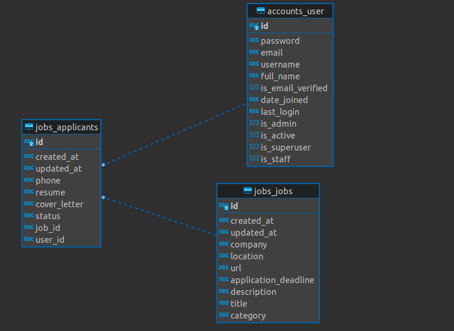
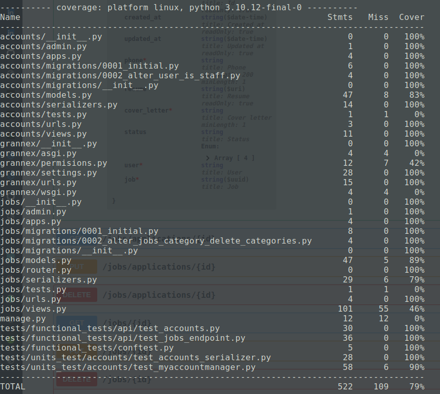

# grannex

screening task for Grannex

# Grannex.Backend

This project was developed as part of an interview evaluation process with Savannah Informatics.

# Table of Contents

- [Docs](#docs)
  - [Swagger](#swagger)
  - [Redocs](#redocs)
- [DataBase Schema](#database-schema)
- [Run Locally](#run-locally)
- [Run with Docker](#run-with-docker)
- [Run Tests](#run-tests)
- [Check Code Coverage](#check-code-coverage)
  - [Sample Report](#sample-report)
- [Tools & Technologies](#tools--technologies)
  - [Languages and Frameworks](#languages-and-frameworks)
  - [Testing & Code Coverage](#testing--code-coverage)
  - [CI/CD](#cicd)
  - [Features](#features)
    - [Pagination](#pagination)
    - [Security](#security)
    - [Caching](#caching)

# Docs

## Swagger

[Swagger Documentation ](https://grannex.azurewebsites.net)

## Redocs

[Link to redocs](https://grannex.azurewebsites.net/redoc)

## PostMan Collection

[](https://app.getpostman.com/run-collection/18483082-04e7f5b8-fa10-4c9a-964e-8278da374038?action=collection%2Ffork&collection-url=entityId%3D18483082-04e7f5b8-fa10-4c9a-964e-8278da374038%26entityType%3Dcollection%26workspaceId%3Dcf222119-a9e3-4dd8-96fe-328c516d2f27)

# DataBase Schema



# Run Locally

1. create a virtual environement

```bash
python3 -m virtualenv venv
```

2. Activate the virtual environment

```bash
source venv/bin/activate
```

3. Install required dependancies

```bash
pip install -r requirements.txt
```

4. Then run the command below

```python

python3 manage.py runserver

```

# Run with Docker

```bash
docker-compose  up --build
```

# Run Tests

```bash
pytest tests/ -v

```

# check Code Coverage

```bash
coverage run -m pytest

coverage report

```

## sample report



# Tools & Technologies

## lanuages and Frameworks

- [Django Rest (Python)](https://www.django-rest-framework.org/)
  Django REST framework is a powerful and flexible toolkit for building Web **APIs** with Python 3.7+ based on standard Python.

## Testing & Code Coverage

- [pytest](https://docs.pytest.org/en/7.4.x/)
  The pytest framework makes it easy to write small, readable tests, and can scale to support complex functional testing for applications and libraries.
- [coverage](https://coverage.readthedocs.io/en/7.3.1/)
  Coverage measurement is typically used to gauge the effectiveness of tests. It can show which parts of your code are being exercised by tests, and which are not.

## CI/CD

- [GithubAction](https://github.com/features/actions)
  GitHub Actions makes it easy to automate all your software workflows, now with world-class CI/CD. Build, test, and deploy your code right from GitHub. Make code reviews, branch management.

## Features

1. ### Pagination

- Implemented pagination using DRF's built-in pagination classes, providing users with an organized and navigable interface.

2. ### Security

- Ensured API security through DRF's authentication and permission classes.
- Implemented authentication mechanisms, including token-based authentication, for secure user access.
- Utilized permission classes to control access to various views or actions based on user roles and permissions.

3. ### Caching

- Used DRF's caching mechanisms to cache frequently accessed API responses.
